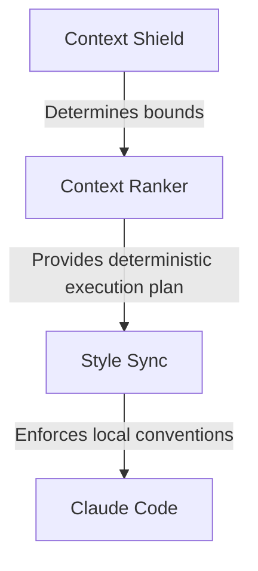

# Forge Architecture

Forge is a deterministic context engine designed for Claude Code. It avoids opaque machine learning, vector databases, and embeddings in favor of explicit, explainable heuristics.

## Component Flow

The system operates in a strict, sequential pipeline:

### 1. Context Shield (`skills/context-shield/SKILL.md`)
The prompting layer that sets the behavioral rules for Claude. It explicitly forbids sweeping reads and mandates that Claude must "Predict before reading" and "Rank before opening."

### 2. Context Ranker (`src/context_ranker.py` & `src/search.py`)
The deterministic engine that executes the Context Shield's rules.
- **`src/search.py`**: A minimal, pluggable IO module that traverses directories and performs fast, line-by-line text checks without fully loading or parsing files.
- **`src/context_ranker.py`**: Extracts normalized keywords (and a tiny list of common synonyms) from the task, scores files based on string/path matching, and outputs a multi-round **Context Execution Plan**. 
- **Why Deterministic?** Deterministic ranking is chosen over AI embeddings because it is completely explainable, requires zero external dependencies, runs instantly on the standard library, and ensures consistent behavior across different codebases.

### 3. Style Sync (`skills/style-sync/SKILL.md`)
Before writing code, this skill mandates a "Verify" phase. Claude must internally ask, *"Would this diff look natural inside this repository?"* and verify naming, formatting, and file placement against the files it just opened.
